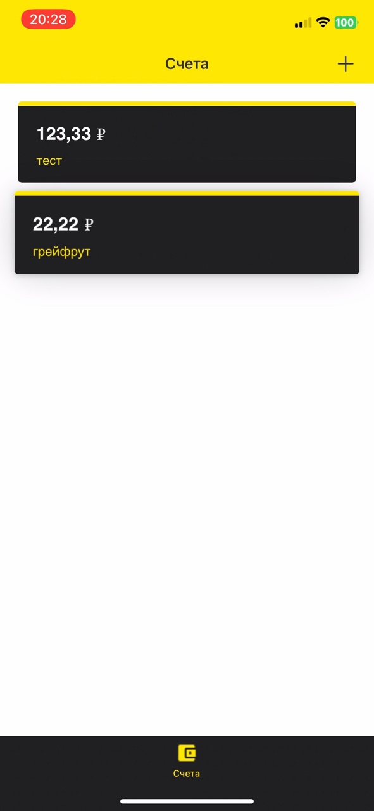
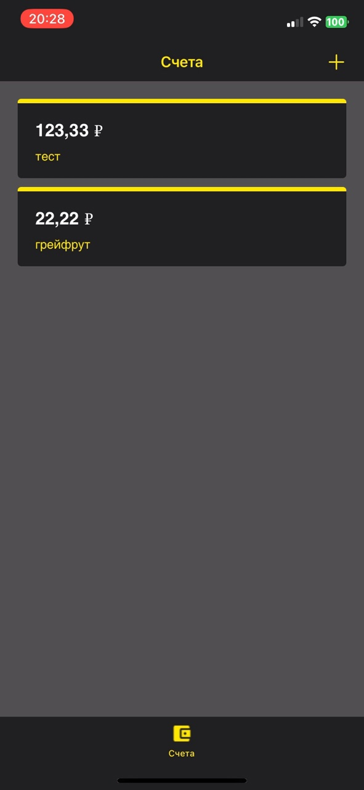
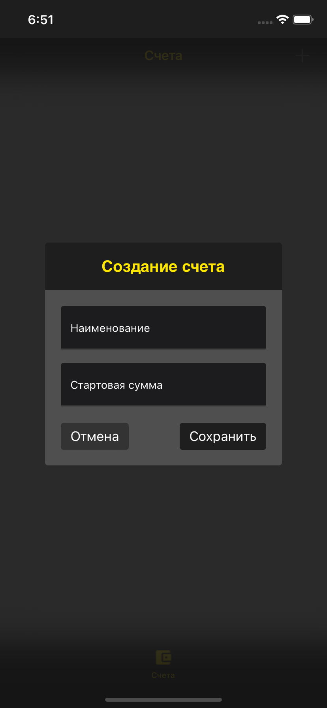

## Billiant

 

## About the project

##### This project is in development. Billiant is an application to help users plan their budget. It is currently implemented on one screen only. This application uses Clean Swift architecture. Alamofire helps me to work with the server. TextControls library for UITextField is also connected. 

| Accounts light | Accounts dark | Create account |
| --- | --- | --- |
||||
##

##### Server-side participant 

